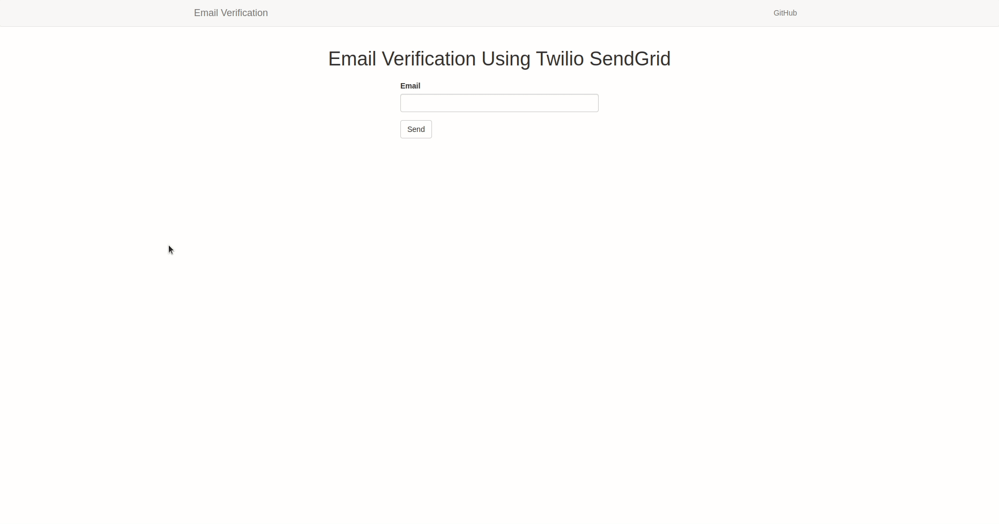

# Email Verification Using Twilio SendGrid

Twilio provides SendGrid that can be used for everything email. This project utilizes the service for the purposes of verifying a user's address.

## Technologies Used

- Flask microframework
- Python for programming
- SendGrid API to handle email needs
- Twilio Verify API for verification
- Flask-bootstrap for responsiveness and aesthetics
- Flask-wtf to create forms
- Python-dotenv to load environment variables

## Features

- Email verification
